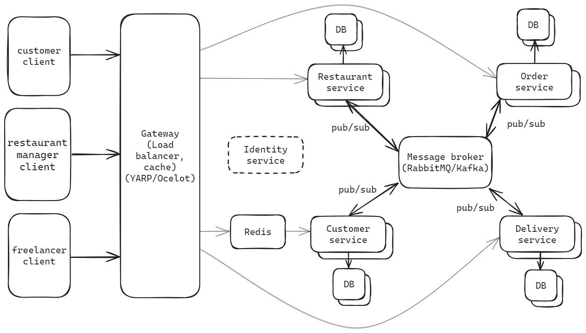

- HangryHub obsahuje několik klientů a byl navržen jako systém s microservisní architekturou
	- tři klientské aplikace:
		- customer client - stará se o objednávání jídel, pro koncové zákazníky
		- restaurant client - umožňuje spravovat restauraci a její menu, pro zaměstnance restaurace
		- freelancer client - výběr objednávek pro rozvoz, pro dovozce
	- backend byl navržen jako několik microservis, klienti s nimi nekomunikují přímo, ale přes gateway, která funguje zároveň jako load balancer a cache
	- architektura umožňuje škálovat kteroukoliv část systému podle potřeby a nezávisle na sobě
	- každá service je nasazena v samostatném container s vlastní instancí databáze, pro tento účel používáme docker
	- services mezi sebou nekomunikují přímo, ale pomocí message brokeru (RabbitMQ) přes publish subscribe
	- synchronizace databází je řešena přes event sourcing
	- v případě velmi vytížených services bude použita distribuovaná cache (Redis)
	- services:
		- Restaurant service - udržuje restaurace a jejich menu, při změně informuje systém o změně publikací zprávy
		- Customer service - zajišťuje vytváření **objednávky**, při dokončení informuje systém o dokončení
			- tato service bude značně více vytížená než ostatní, proto byla přidána distribuovaná cache (Redis)
		- Order service - při zachycení zprávy o vzniku objednávky je vytvořena, restaurace může přijmout, zamítnout
		- Delivery service - při zachycení zprávy o vzniku a potvrzení objednávky, umožňují zásilku vybrat dovozcům, zajišťuje doručení objednávky

#### Odhad ceny a počet požadavků
- systém poběží na jednom Azure Kubernetes clusteru
- předpoklady:
	- cena je stanovena podle nákladů na provoz nejvytíženější service - customer
	- lze předpokládat, že největší vytížení bude ve špičce (kolem oběda), která cca trvá 3 hodiny
	- uživatel udělá 10 požadavků na customer service během jedné objednávky
- v případě nedostačnosti zdrojů ve špičce, lze dokoupit zdroje pro dané časové okno
- 1000 uživatelů
	- (1000 \* 10) / 180 = 55 požadavků za minutu, zaokrouhleno 60, tedy 1 požadavek za sekundu
	- bude použita instance A4 v2: 4 jádra, 8 GM RAM, disk 1024 GB
		- 1 cluster, 1 VM
	- cena: 247,55 US$ (podle https://azure.microsoft.com/cs-cz/pricing/calculator/)
- 10000 uživatelů
	- (10000 \* 10) / 180 = 555 požadavků za minutu, 10 požadavků za sekundu
	- instance: A8 v2: 8 jader, 16 GB RAM, disk 2048 GB
		- 1 cluster, 1 VM
	- cena: 434,51 US$
- 1000000 uživatelů
	- (1000000 \* 10) / 180 = 5555 požadavků za minutu
	- instance: A8m v2: 8 Jádra, 64 GB RAM, disk 8192 GB
		- 4 clusters, 2 VM
	- cena: 1 416,84 US$
